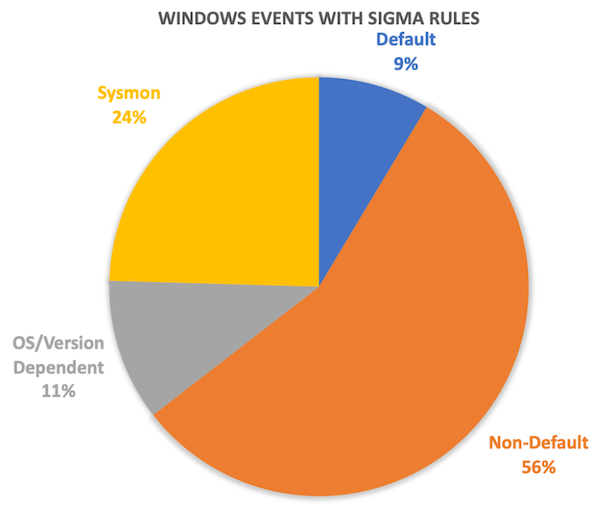
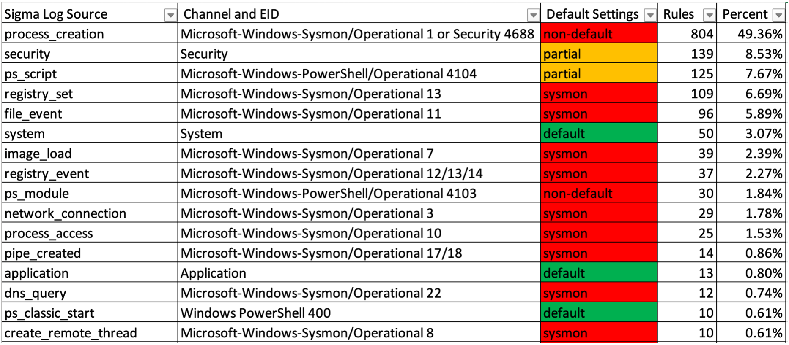
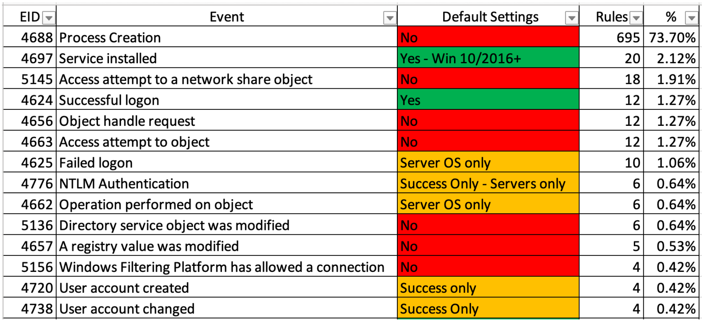

<div align="center">
 <h1>
    
 </h1>
 <h1>Yamato Security's Windows Event Log Configuration Guide For DFIR And Threat Hunting</h1>
 [ <b>English</b> ] | [<a href="README-Japanese.md">日本語</a>]
</div>
<p>

This is yet another guide on properly configuring and monitoring Windows event logs with an emphasis on logging for [sigma](https://github.com/SigmaHQ/sigma) rules.

> This is a work in progress, so check back please periodically for updates.

# TLDR

* You can only use around 10~20% of [sigma](https://github.com/SigmaHQ/sigma) detection rules with the default Windows audit settings.
* Even if a Windows log is enabled, by default, the maximum size for logs is between 1~20 MB so there is a good chance that evidence gets quickly overwritten.
* Enable the proper audit settings with [YamatoSecurityConfigureWinEventLogs.bat](YamatoSecurityConfigureWinEventLogs.bat) to use up to around 75% of sigma rules and retain logs for as long as you need them.
    - **Warning: make sure you customize the script to your needs and test before using in production!**
* Install [sysmon](https://learn.microsoft.com/en-us/sysinternals/downloads/sysmon) to get full coverage. (**Highly recommended!**)

# Companion Projects

* [Hayabusa](https://github.com/Yamato-Security/hayabusa) - sigma-based threat hunting and fast forensics timeline generator for Windows event logs.
* [Hayabusa Rules](https://github.com/Yamato-Security/hayabusa-rules) - detection rules for hayabusa.
* [Hayabusa Sample EVTXs](https://github.com/Yamato-Security/hayabusa-sample-evtx) - Sample evtx files to use for testing hayabusa/sigma detection rules.
* [Takajo](https://github.com/Yamato-Security/takajo) - Analyzer for hayabusa results.
* [WELA (Windows Event Log Analyzer)](https://github.com/Yamato-Security/WELA) - An analyzer for Windows event logs written in PowerShell.

# Table of Contents

- [TLDR](#tldr)
- [Companion Projects](#companion-projects)
- [Table of Contents](#table-of-contents)
- [Author](#author)
- [Contributors](#contributors)
- [Acknowledgements](#acknowledgements)
- [Problems with the default Windows log settings](#problems-with-the-default-windows-log-settings)
- [Warning: Make changes to your systems at your own risk!](#warning-make-changes-to-your-systems-at-your-own-risk)
- [Important Windows event logs](#important-windows-event-logs)
  - [Sigma's top log sources](#sigmas-top-log-sources)
    - [Top sigma log sources](#top-sigma-log-sources)
    - [Top Security Event IDs](#top-security-event-ids)
- [Increasing the maximum file size](#increasing-the-maximum-file-size)
  - [Option 1: Manually through Event Viewer](#option-1-manually-through-event-viewer)
  - [Option 2: Windows built-in tool](#option-2-windows-built-in-tool)
  - [Option 3: PowerShell](#option-3-powershell)
  - [Option 4: Group Policy](#option-4-group-policy)
- [Configuration script](#configuration-script)
- [Configuring log settings](#configuring-log-settings)
  - [Sysmon log (1382 sigma rules)](#sysmon-log-1382-sigma-rules)
  - [Security log (1045 sigma rules (903 process creation rules + 142 other rules))](#security-log-1045-sigma-rules-903-process-creation-rules--142-other-rules)
  - [Powershell logs (175 sigma rules)](#powershell-logs-175-sigma-rules)
    - [Module logging (30 sigma rules)](#module-logging-30-sigma-rules)
      - [Enabling module logging](#enabling-module-logging)
        - [Option 1: Enabling through group policy](#option-1-enabling-through-group-policy)
        - [Option 2: Enabling through the registry](#option-2-enabling-through-the-registry)
    - [Script Block Logging (134 sigma rules)](#script-block-logging-134-sigma-rules)
      - [Enabling Script Block logging](#enabling-script-block-logging)
      - [Option 1: Enabling through group policy](#option-1-enabling-through-group-policy-1)
      - [Option 2: Enabling through the registry](#option-2-enabling-through-the-registry-1)
    - [Transcription logging](#transcription-logging)
      - [Enabling Transcription logging](#enabling-transcription-logging)
        - [Option 1: Enabling through group policy](#option-1-enabling-through-group-policy-2)
        - [Option 2: Enabling through the registry](#option-2-enabling-through-the-registry-2)
    - [References](#references)
  - [System log (55 sigma rules)](#system-log-55-sigma-rules)
  - [Application log (16 sigma rules)](#application-log-16-sigma-rules)
  - [Windows Defender Operational log (10 sigma rules)](#windows-defender-operational-log-10-sigma-rules)
  - [Bits-Client Operational log (6 sigma rules)](#bits-client-operational-log-6-sigma-rules)
  - [Firewall log (6 sigma rules)](#firewall-log-6-sigma-rules)
  - [NTLM Operational log (3 sigma rules)](#ntlm-operational-log-3-sigma-rules)
  - [Security-Mitigations KernelMode and UserMode logs  (2 sigma rules)](#security-mitigations-kernelmode-and-usermode-logs--2-sigma-rules)
  - [PrintService logs (2 sigma rules)](#printservice-logs-2-sigma-rules)
    - [Admin (1 sigma rule)](#admin-1-sigma-rule)
    - [Operational (1 sigma rule)](#operational-1-sigma-rule)
  - [SMBClient Security log (2 sigma rules)](#smbclient-security-log-2-sigma-rules)
  - [AppLocker logs (1 sigma rule)](#applocker-logs-1-sigma-rule)
  - [CodeIntegrity Operational log (1 sigma rule)](#codeintegrity-operational-log-1-sigma-rule)
  - [Diagnosis-Scripted Operational log (1 sigma rule)](#diagnosis-scripted-operational-log-1-sigma-rule)
  - [DriverFrameworks-UserMode Operational log  (1 sigma rule)](#driverframeworks-usermode-operational-log--1-sigma-rule)
  - [WMI-Activity Operational log  (1 sigma rule)](#wmi-activity-operational-log--1-sigma-rule)
  - [TerminalServices-LocalSessionManager Operational log  (1 sigma rule)](#terminalservices-localsessionmanager-operational-log--1-sigma-rule)
  - [TaskScheduler Operational log  (1 sigma rule)](#taskscheduler-operational-log--1-sigma-rule)

# Author

Zach Mathis ([@yamatosecurity](https://twitter.com/yamatosecurity)). As I do more research and testing, I plan on periodically updating this as there is much room for improvement (both in the documentation as well as in creating more detection rules.) PRs are welcome and will gladly add you as a contributor. If you find any errors in this documentation, please let me know and I will fix them as soon as possible.

If you find any of this useful, please give a star on GitHub as it will probably help motivate me to continue updating this.

# Contributors

* DustInDark (hitenkoku): Japanese translation fixes.
* Fukusuke Takahashi (fukusuket): Japanese translations and fixes.
* LasseKrache: Pointing out a bug in the batch script.

# Acknowledgements

Most of the information comes from Microsoft's [Advanced security auditing FAQ](https://learn.microsoft.com/en-us/windows/security/threat-protection/auditing/advanced-security-auditing-faq), [sigma](https://github.com/SigmaHQ/sigma) rules, the [ACSC Event Logging Guide](https://www.cyber.gov.au/acsc/view-all-content/publications/windows-event-logging-and-forwarding) and my own research/testing. I would like to thank the [sigma community](https://github.com/SigmaHQ/sigma/graphs/contributors) in particular for making threat detection open source and free for the benefit of all of the defenders out there.

# Problems with the default Windows log settings

By default, Windows will not log many events necessary for detecting malicious activity and performing forensics investigations.
Also, the default maxium size for event files is only 20 MB for the classic event logs (`Security`, `System`, `Application`), 15 MB for PowrShell and a mere 1 MB for almost all of the other logs so there is a good chance that evidence is overwritten over time.
A simple [batch script](YamatoSecurityConfigureWinEventLogs.bat) in this repository have been provided to let systems administrators easily configure their Windows machines so that they will have the logs that they need when an incident occurs. For large networks, you probably want to use this document as a reference and configure your endpoints with Group Policy and/or InTune.

# Warning: Make changes to your systems at your own risk!

I highly recommend to improve the default Windows event logging settings and try my best to provide the most accurate information. However, I do not take any responsibility for any adverse effects of enabling too much logging or the accuracy of anything in this repository.
It is your responsibility to understand and test out any changes you make to your systems on test machines before rolling out to production.
I recommend turning on as much logging as possible on test machines that mimic your environment for at least a week and then confirm if there are any events that are generating too much noise or if there are events that you want but are not being generated.

You can view the total number and percent of Event IDs in an `evtx` file with [Hayabusa](https://github.com/Yamato-Security/hayabusa)'s event ID metrics command.

Example: `hayabusa.exe eid-metrics -f path/to/Security.evtx`

# Important Windows event logs

1. The most important event log to turn on is probably `Process Creation` which tracks what processes are run on a system.
  Currently, about half of [Sigma](https://github.com/SigmaHQ/sigma)'s detection rules rely on this event.
  This can be accomplished by installing Sysmon (Event ID `1`) or enabling the built-in Security log Event ID `4688`.
  `Sysmon 1` will provide detailed information such as hashes and metadata of the executable so is ideal but in the case that Sysmon cannot be installed it is possible use built-in `Security 4688` logs. However, it is important that command line logging is also enabled as many detection rules rely on this. Unfortunately `Security 4688` does not provide as detailed information as the Sysmon process creation logs, so not all `Process Creation` rules work with `Security 4688`.
2. The second most important event log is a properly tuned Security log.
3. The third most important are probably PowerShell Module logging and ScriptBlock logging as attackers will often abuse PowerShell.
4. The forth are probably all of the other Sysmon events.
5. After these, there are many other logs under the "Application and Services Logs" folder that are also very important: AppLocker, Bits-Client, NTLM, PowerShell, PrintService, Security-Mitigations, Windows Defender, Windows Firewall With Advanced Security, WMI-Activity, etc...

## Sigma's top log sources



Approximately only 10~20% of sigma rules can be used with the default Windows audit settings!

### Top sigma log sources



### Top Security Event IDs



# Increasing the maximum file size

## Option 1: Manually through Event Viewer

This is not practical to do at scale, but the easiest way to enable/disable logs and check and/or configure their maximum file size is by right-clicking on the log in Event Viewer and opening up `Properties`.

## Option 2: Windows built-in tool

You can use the built-in `wevtutil` command.

Example: `wevtutil sl Security /ms:1073741824` to increase the maximum file size for the Security log to 1 GB.

## Option 3: PowerShell

Example:
```powershell
$sysmon = Get-WinEvent -ListLog Microsoft-Windows-Sysmon/Operational
$sysmon.MaximumSizeInBytes = 2048000000 #2GB
$sysmon.SaveChanges()
```

## Option 4: Group Policy

It is straightforward to increase the maximum file size for the classic event logs such as `Security`, `System`, and `Application`, however, unfortunately you need to install Administrative Templates and/or directly modify the registry in order to change the maximum file size for the other logs. It may just be easier to increase the file size with a batch or PowerShell script on startup.

# Configuration script

A script to increase the maximum file size and enable the proper logs has been provided here: [YamatoSecurityConfigureWinEventLogs.bat](YamatoSecurityConfigureWinEventLogs.bat)

# Configuring log settings

## Sysmon log (1382 sigma rules)

File: `Microsoft-Windows-Sysmon%4Operational.evtx`

Default settings: `Not installed`

Installing and configuring sysmon is the single best thing you can do to increase your visibility on Windows endpoints but it will require planning, testing and maintenance.
This is a big topic in itself so it is out of scope of this document at the moment.
Please check out the following resources:
* [TrustedSec Sysmon Community Guide](https://github.com/trustedsec/SysmonCommunityGuide)
* [Sysmon Modular](https://github.com/olafhartong/sysmon-modular)
* [Florian Roth's updated fork of the Swift On Security's sysmon config file](https://github.com/Neo23x0/sysmon-config)
* [Ion-storm's updated fork of the Swift On Security's sysmon config file](https://github.com/ion-storm/sysmon-config)
* [Cyb3rWard0g's sysmon config file](https://github.com/OTRF/Blacksmith/blob/master/resources/configs/sysmon/sysmon.xml)

## Security log (1045 sigma rules (903 process creation rules + 142 other rules))

File: `Security.evtx`

Default settings: `Partially enabled`

The Security log is the most complex to configure so I have created a seperate document for it: [ConfiguringSecurityLogAuditPolicies.md](ConfiguringSecurityLogAuditPolicies.md)

## Powershell logs (175 sigma rules)

File: `Microsoft-Windows-PowerShell%4Operational.evtx`

### Module logging (30 sigma rules)

Turning on module logging will enable event ID `4103`.
Module logging has the advantage that it can run on older OSes and versions of PowerShell: PowerShell 3.0 (Win 7+).
Another benefit is that it logs both the PowerShell command executed as well as the results.
The disadvantage is that it will create an extremely high number of events.
For example, if an attacker runs Mimikatz, it will create 7 MB of logs with over 2000 events!

#### Enabling module logging

Default settings: `No Auditing`

##### Option 1: Enabling through group policy
In the Group Policy editor (`gpedit.msc`), open `Computer Configuration > Administrative Templates > Windows Components > Windows PowerShell` and enable `Turn on Module Logging`.
In the `Options` pane, click the `Show...` button to configure what modules to log.
Enter `*` in the `Value` textbox to record all modules.

##### Option 2: Enabling through the registry
```
HKLM\SOFTWARE\Wow6432Node\Policies\Microsoft\Windows\PowerShell\ModuleLogging → EnableModuleLogging = 1
HKLM\SOFTWARE\Wow6432Node\Policies\Microsoft\Windows\PowerShell\ModuleLogging\ModuleNames → * = *
```

### Script Block Logging (134 sigma rules)

Default settings: `On Win 10/2016+, if a PowerShell script is flagged as suspicious by AMSI, it will be logged with a level of Warning.`

Turning on Script Block logging will enable event ID `4104`. If you enable `Log script block invocation start / stop events`, EID `4105` and `4106` will also be enabled, however, this is not recommended as it will just create noise.
Script Block logging is supported by default in PowerShell 5.0+ (Win 10+), however you can enable this on older OSes (Win 7+) if you install .NET 4.5 and WMF 4.0+.
Unfortunately, the maximum size of a single Windows event log is 32 KB so any PowerShell scripts greater than this will be fragmented in 32 KB sized blocks.
If you have the original `PowerShell Operational.evtx` file, you can use the [block-parser](https://github.com/matthewdunwoody/block-parser) tool to un-fragment these logs into a single easily readable text file.
One good thing about Script Block logging is that even if a malicious script is obfuscated with XOR, Base 64, ROT13, etc... the decoded script will be logged making analysis much easier.
The logs are more reasonable to work with than module logging as if an attacker runs Mimikatz, only 5 MB and 100 events will generated compared to the 7 MB and over 2000 events.
However, the output of the commands are not recorded with Script Block logging.

#### Enabling Script Block logging

#### Option 1: Enabling through group policy

In the Group Policy editor, open `Computer Configuration > Administrative Templates > Windows Components > Windows PowerShell` and enable `Turn on PowerShell Script Block Logging`.

#### Option 2: Enabling through the registry

`HKLM\SOFTWARE\Wow6432Node\Policies\Microsoft\Windows\PowerShell\ScriptBlockLogging → EnableScriptBlockLogging = 1`

### Transcription logging

Default settings: `No Auditing`

It is possible to also save PowerShell logs to text files on the local computer with transcription logs.
While an attacker can usually easily delete the transcription logs for anti-forensics, there may be scenarios where the attacker clears all of the event logs but does not search for transcription logs to delete.
Therefore, it is recommended to also enable transcription logs if possible.
By default, they are saved to the user's documents folder.
Ideally transcript logs should be saved to a write-only network file share, however, this may be difficult to implement in practice.
A benefit of transcription logs is they include the timestamp and metadata for each command and are very storage efficient with less than 6 KB for Mimikatz execution.
The downside is that the transcription logs only record what appears in the PowerShell terminal.

#### Enabling Transcription logging

##### Option 1: Enabling through group policy

In the Group Policy editor, open `Computer Configuration > Administrative Templates > Windows Components > Windows PowerShell` and enable `Turn on PowerShell Transcription`.
Then, specify the output directory.

##### Option 2: Enabling through the registry
```
HKLM\SOFTWARE\Wow6432Node\Policies\Microsoft\Windows\PowerShell\Transcription → EnableTranscripting = 1
HKLM\SOFTWARE\Wow6432Node\Policies\Microsoft\Windows\PowerShell\Transcription → EnableInvocationHeader = 1
HKLM\SOFTWARE\Wow6432Node\Policies\Microsoft\Windows\PowerShell\Transcription → OutputDirectory = “” (Enter path. Empty = default)
```

### References

* [Mandiant Blog: Greater Visibility Through PowerShell Logging](https://www.mandiant.com/resources/blog/greater-visibilityt)

## System log (55 sigma rules)

File: `System.evtx`

Default settings: `Enabled. 20 MB`

Recommended settings: `Enabled. 128 MB+`

Malware will often install services for persistence, local privilege esclation, etc... which can be found in this log.
It is also possible to detect various vulnerabilities being exploited here.

> **Note: One thing to watch out specific to the System log is that parameters in fields are sometimes translated to the local language so signatures that use only English may not detect on non-English systems. For example, on an English system in the parameters for EID 7045, it will record `Enabled` while in Japanese it might record `有効`.**

> **Note: Just like the `Application` log, multiple providers will log to the same event ID so you may need to filter on provider name as well as the channel. An example is event ID `1` which gets used by various providers for different events.**

Important Event IDs:

| Event ID | Description | Sigma Rules | Hayabusa Rules | Level | Notes |
| :---: | :---: | :---: | :---: | :---: | :---: |
| 1 | System Sleep/Hibernation | 0 | Not Yet. | Info | Provider: `Power-Troubleshooter` |
| 1 | System Time Changed | 0 | Not Yet. | Info | Provider: `Kernel-General` |
| 12 | OS Startup | 0 | Not Yet. | Info | |
| 13 | OS Shutdown | 0 | Not Yet. | Info | |
| 16 | Registry Hive Access History Cleared | 2 | Not Yet. | High~Crit | Password dumpers may clear access history after dumping passwords hashes from the SAM registry key. This also happens normally though so need to filter out FPs. |
| 55 | NTFS Filesystem Corrupted | 1 | No | High | Can detect attacks against NTFS vulnerabilities. |
| 104 | System Event Log Cleared | 1 | Yes | Med | |
| 6005 | Event Log Service Started | 0 | Yes | Info | |
| 6006 | Event Log Service Stopped | 0 | Yes | Info | |
| 6008 | Unexpected Shutdown | 0 | Yes | Info | |
| 6038 | NTLMv1 Was Used | 1 | No | Low | |
| 7031 | Service Crashed | 0 | Yes | Low | |
| 7034 | Service Crashed | 0 | Yes | Low | |
| 7036 | Service Started/Stopped | 2 | Yes | Info~High | Can be used to detect someone stopping Defender, etc... |
| 7040 | Service Startup Type Changed | 0 | Yes | Info | Can indicate an attacker disabled a service. |
| 7045 | Service Installation | 37 | Yes | Info~Crit | This is the most important System event ID as malware often installs itself as a service or abuses services. |
| 20001 | New PNP Device | 0 | Yes | Info~? | Level will depend on if USB devices are allowed or not. Logs only the first time a device has been plugged in. Non-USB PNP device events are very noisy so should probably be filtered out.  |

## Application log (16 sigma rules)

This log is mostly noise but you may be able to find some important evidence here.
Some 3rd-party anti-virus software will log to here.
One thing to be careful about with the Application log is that different vendors will use the same event IDs for different events so you should also filter on not just Event IDs but Provider Names as well.

File: `Application.evtx`

Default settings: `Enabled. 20 MB`

Recommended settings: `Enabled. 128 MB+`

Important Event IDs:

| Event ID | Provider | Description | Sigma Rules | Hayabusa Rules | Level | Notes |
| :---: | :---: | :---: | :---: | :---: | :---: | :---: |
| 1 | `Audit-CVE`, `Microsoft-Windows-Audit-CVE` | Known Vulnerability (CVE) Exploit Attempt | 1 | No | Critical | Detects events generated by user-mode applications when they call the CveEventWrite API when a known vulnerability is trying to be exploited. MS started using this log in 2020/01 with CVE-2020-0601 (a Windows CryptoAPI vulnerability). Unfortunately, that is about the only instance of CVEs being written to this log.  |
| 325 | `ESENT` | ESE DB Created | 2 | No | Info~Crit | Detects when a process creates an ESE database. This is used by a variety of things such as for Exchange, AD, Certificate Services, SRUM, etc... The most important ESE DB for security is NTDS.dit, the file of all domain users' password hashes located on domain controllers. There are two sigma rules to detect dumping of NTDS.dit, however, it may be a false positive if an administrator uses ntdsutil for backups or when shadow copies are created.  |
| 326 | `ESENT` | ESE DB Attached | 1 | No | Info~Crit | May be able to detect access to NTDS.dit.  |
| 1000, 1001 | `Application Error`, `Windows Error Reporting` | Application Error | 1 | No | Info~High |  |
| 1034, 11724 | `MsiInstaller` | Application Uninstalled | 1 | No | Info~Low | |
| 1040 | `MsiInstaller` | Application Installation | 1 | No | Info~Med |  |
| 33205 | `MSSQLSERVER` | SQL Audit Event | 6 | No | Info~High | Can detect MSSQL backdoors, SQL/command injection, etc...   |


## Windows Defender Operational log (10 sigma rules)

File: `Microsoft-Windows-Windows Defender%4Operational.evtx`

Default settings: `Enabled. 1 MB`

Recommended settings: `Enabled. 128 MB+`

You can detect not only Windows Defender alerts (which are important to monitor), but also exclusions being added, tamper protection being disabled, history deleted, etc...

## Bits-Client Operational log (6 sigma rules)

File: `Microsoft-Windows-Bits-Client%4Operational.evtx`

Default settings: `Enabled. 1 MB`

Recommended settings: `Enabled. 128 MB+`

Bitsadmin.exe is a popular [lolbin](https://lolbas-project.github.io/lolbas/Binaries/Bitsadmin/) that attackers will abuse for downloading and executing malware.
You may find evidence of that in this log, although there will be a lot of false positives to watch out for.

## Firewall log (6 sigma rules)

File: `Microsoft-Windows-Windows Firewall With Advanced Security%4Firewall.evtx`

Default settings: `Enabled? 1 MB`

Recommended settings: `Enabled. 256 MB+`

You can find evidence of firewall rules being added/modified/deleted here.
Malware will often add firewall rules to make sure they can communicate with their C2 server, add proxy rules for lateral movement, etc...

## NTLM Operational log (3 sigma rules)

File: `Microsoft-Windows-NTLM%4Operational.evtx`

Default settings: `Enabled but Auditing is disabled. 1 MB`

This log is recommended to enable if you want to disable NTLM authentication.
Disabling NTLM will most likely break some communication, so you can monitor this log on the DCs and other servers to see who is still using NTLM and disable NTLM gradually starting with those users before disabling it globally.
It is possible to detect NTLM being used for incoming connections in logon events such as 4624 but you need to enable this log if you want to monitor who is making outgoing NTLM connections.

To enable auditing, in Group Policy open `Computer Configuration > Policies > Windows Settings > Security Settings > Local Policies > Security Options` and configure the proper various `Network security: Restrict NTLM:` settings.

Reference: [Farewell NTLM](https://www.scip.ch/en/?labs.20210909)

## Security-Mitigations KernelMode and UserMode logs  (2 sigma rules)

Files: `Microsoft-Windows-Security-Mitigations%4KernelMode.evtx`, `Microsoft-Windows-Security-Mitigations%4UserMode.evtx`

Default settings: `Enabled. 1 MB`

Recommended settings: `Enabled. 128 MB+`

At the moment there are only 2 sigma rules for these logs but you should probably be collecting and monitoring all of the Exploit Protection, Network Protection, Controlled Folder Access and Attack Surface Reduction logs (About 40+ Event IDs).

Unfortunately the Attack Surface Reduction logs (previously WDEG(Windows Defender Exploit Guard) and EMET) are spread across multiple logs and require complex XML queries to search them.

Details: [Understand and use attack surface reduction capabilities](https://learn.microsoft.com/en-us/microsoft-365/security/defender-endpoint/overview-attack-surface-reduction?view=o365-worldwide)

## PrintService logs (2 sigma rules)

It is recommended to enable the Operational log as well to detect Print Spooler attackers. (Ex: PrintNightmare, etc...)

### Admin (1 sigma rule)

File: `Microsoft-Windows-PrintService%4Admin.evtx`

Default settings: `Enabled. 1 MB`

Recommended settings: `Enabled. 128 MB+`

### Operational (1 sigma rule)

File: `Microsoft-Windows-PrintService%4Operational.evtx`

Default settings: `Disabled. 1 MB`

Recommended settings: `Enabled. 128 MB+`

## SMBClient Security log (2 sigma rules)

File: `Microsoft-Windows-SmbClient%4Security.evtx`

Default settings: `Enabled. 8 MB`

Recommended settings: `Enabled. 128 MB+`

Used to attempt to detect PrintNightmare (Suspicious Rejected SMB Guest Logon From IP) and users mounting hidden shares.

## AppLocker logs (1 sigma rule)

Files: `Microsoft-Windows-AppLocker%4MSI and Script.evtx`, `Microsoft-Windows-AppLocker%4EXE and DLL.evtx`, `Microsoft-Windows-AppLocker%4Packaged app-Deployment.evtx`, `Microsoft-Windows-AppLocker%4Packaged app-Execution.evtx`

Default settings: `Enabled if AppLocker is enabled? 1 MB`

Recommended settings: `Enabled. 256 MB+`

This is important to make sure is enabled and monitored if you are using AppLocker.

## CodeIntegrity Operational log (1 sigma rule)

File: `Microsoft-Windows-CodeIntegrity%4Operational.evtx`

Default settings: `Enabled. 1 MB`

Recommended settings: `Enabled. 128 MB+`

Check this log to detect driver load events that get blocked by Windows code integrity checks, which may indicate a malicious driver that faild to load.

## Diagnosis-Scripted Operational log (1 sigma rule)

File: `Microsoft-Windows-Diagnosis-Scripted%4Operational.evtx`

Default settings: `Enabled. 1 MB`

Recommended settings: `Enabled. 128 MB+`

Evidence of diagcab packages being used for exploitation may be found here.

## DriverFrameworks-UserMode Operational log  (1 sigma rule)

Files: `Microsoft-Windows-DriverFrameworks-UserMode%4Operational.evtx`

Default settings: `No Auditing. 1 MB`

Recommended settings: `Enabled. 128 MB+`

Detects plugged in USB devices.

## WMI-Activity Operational log  (1 sigma rule)

File: `Microsoft-Windows-WMI-Activity%4Operational.evtx`

Default settings: `Enabled on Win10/2016+. 1 MB`

Recommended settings: `Enabled. 128 MB+`

This is important to monitor as attackers will often exploit WMI for persistence and lateral movement.

## TerminalServices-LocalSessionManager Operational log  (1 sigma rule)

File: `Microsoft-Windows-TerminalServices-LocalSessionManager%4Operational.evtx`

Default settings: `Enabled. 1 MB`

Recommended settings: `Enabled. 128 MB+`

Detects when ngrok, a reverse proxy tool, forwards traffic to the local RDP port to bypass firewalls.

Link: [Bypassing Network Restrictions Through RDP Tunneling](https://www.mandiant.com/resources/blog/bypassing-network-restrictions-through-rdp-tunneling)

## TaskScheduler Operational log  (1 sigma rule)

File: `Microsoft-Windows-TaskScheduler%4Operational.evtx`

Default settings: `Disabled. 1 MB`

Recommended settings: `Enabled. 128 MB+`

Attackers will often abuse tasks for persistence and lateral movement so this should be enabled.